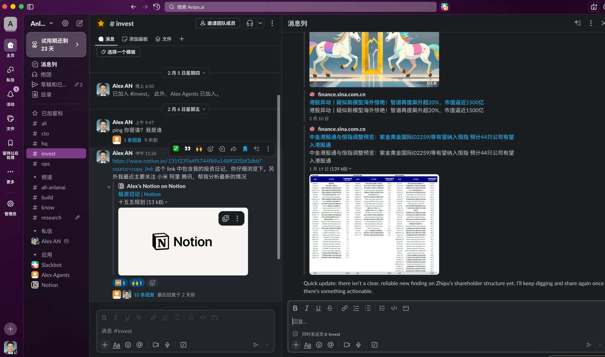
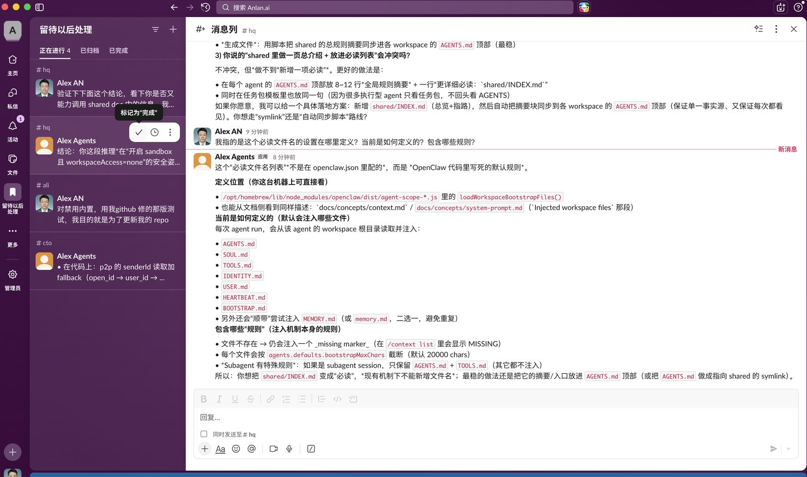
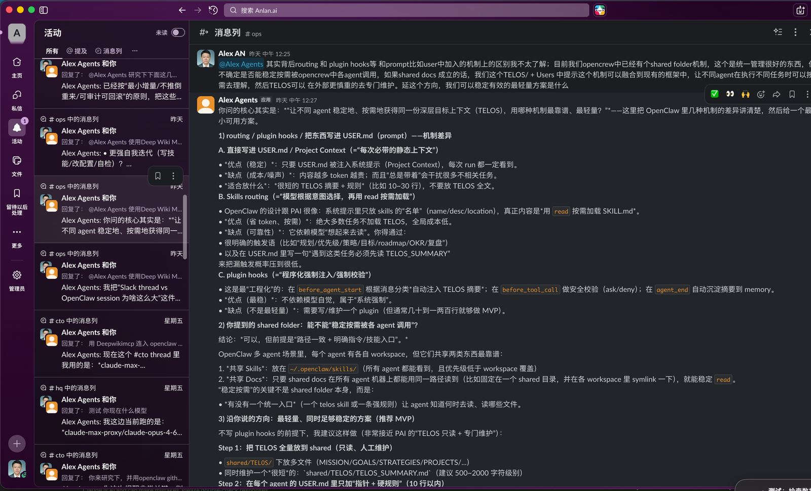
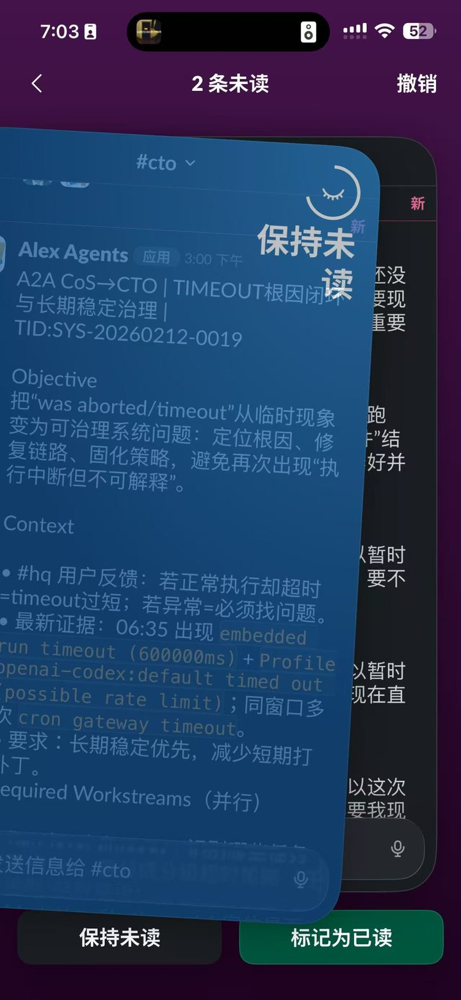

[中文](../SCREENSHOTS.md) | **English**

# Screenshots

> These screenshots are used for README/docs display (resized and compressed to minimize repo size).
>
> Path: `assets/screenshots/`

## Desktop

## Mobile

